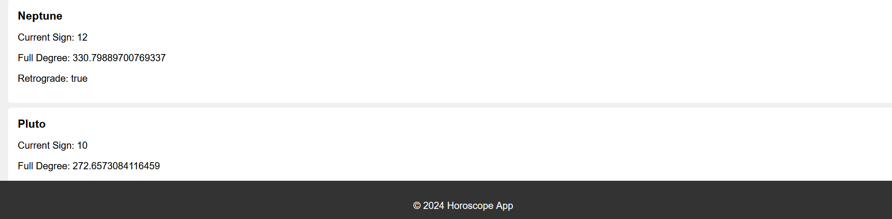

# Planet Horoscope Predictor


      

---

## Overview

The "Planet Horoscope Predictor" project is a web application built using Node.js, Express.js, and EJS that allows users to predict the positions of planets, their degrees of rotation, and current zodiac signs. This application leverages external APIs to fetch real-time planetary data and provides an intuitive interface for users to explore astrological insights.

---

## Features

- **Real-Time Planetary Data:** Fetches current planetary positions including direction, degree of rotation, and zodiac sign.
- **Interactive Interface:** User-friendly interface using EJS templates to visualize planetary information dynamically.
- **Multiple Planet Selection:** Allows users to select specific planets for detailed predictions.
- **Responsive Design:** Ensures seamless experience across devices with responsive design principles.
- **Astrological Insights:** Provides astrological interpretations based on planetary positions and zodiac signs.

---

## Technologies Used

- **Node.js:** Backend JavaScript runtime environment.
- **Express.js:** Web framework for building APIs and web applications.
- **EJS:** Embedded JavaScript templates for rendering dynamic HTML pages.
- **Axios:** HTTP client for making API requests.
- **Body Parser:** Middleware for parsing incoming request bodies.

---

## Installation

To run the project locally, follow these steps:

1. Clone the repository:
   ```bash
   git clone <repository-url>
   cd planet-horoscope-predictor
2. Install dependencies:
   ```bash
   npm install
3. Set up environment variables (if applicable).

---

## Usage

1. Start the server:
   ```bash
   node app.js
2. Open your browser and navigate to http://localhost:3000 to view the application.

---

## Contributing

Contributions are welcome! Please fork the repository and submit a pull request with your improvements. Ensure to follow the coding standards and include relevant tests.

---

## License

This project is licensed under the MIT License. See the LICENSE file for details.

---

## Contact

For any inquiries or suggestions, feel free to reach out to:

**Name:** Yash Jain
**Email:** yashjanss1@gmail.com
**LinkedIn:** [Yashh Jainn](https://www.linkedin.com/in/yashh-jainn/)

---


